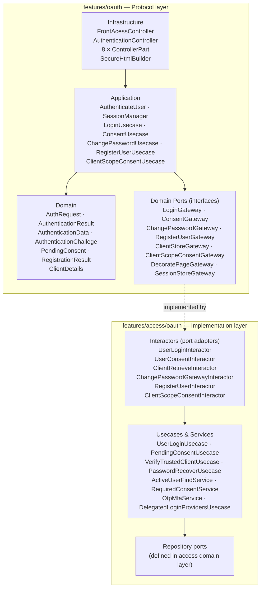

# OAuth / OIDC — Architecture

## Layered dependency diagram

Dependencies point **inward only**: infrastructure → application → domain. The access module
provides the concrete implementations of the domain ports.



---

## Package map

```
src/main/java/net/civeira/phylax/features/
│
├── oauth/
│   ├── authentication/
│   │   ├── domain/
│   │   │   ├── AuthRequest.java              ← VO: all OIDC query params
│   │   │   ├── AuthenticationResult.java     ← Either<AuthenticationData, Exception>
│   │   │   ├── AuthenticationData.java       ← VO: authenticated user data (uid, roles, scopes)
│   │   │   ├── AuthenticationChallege.java   ← Enum: PASSWORD, MFA, FRESH_PASSWORD,
│   │   │   │                                        USE_CONSENT, CLIENT_CONSENT
│   │   │   ├── exception/                    ← One exception per challenge type
│   │   │   ├── event/                        ← Domain events
│   │   │   └── gateway/
│   │   │       └── DecoratePageGateway.java  ← Port: HTML page rendering
│   │   ├── application/
│   │   │   ├── AuthenticateUser.java         ← authenticate() / preAuthenticate()
│   │   │   ├── SessionManager.java
│   │   │   └── granter/                      ← Token grant type strategies
│   │   └── infrastructure/driver/
│   │       ├── html/
│   │       │   ├── FrontAcessController.java ← JAX-RS: /auth /recover /register /logout …
│   │       │   ├── SecureHtmlBuilder.java    ← CSRF tokens, field encryption snippets
│   │       │   ├── DelegatedAccessController.java ← /delegated/token/{provider}
│   │       │   └── part/                     ← One ControllerPart per challenge type
│   │       └── rest/
│   │           ├── AuthenticationController.java  ← /token /introspect
│   │           ├── InformationController.java     ← /userinfo
│   │           └── DevicesAccessController.java   ← /device /par-request /ciba-auth (405)
│   │
│   ├── user/
│   │   ├── domain/
│   │   │   ├── PendingConsent.java           ← VO: (relyingParty, consentText)
│   │   │   ├── RegistrationResult.java       ← VO: Status {OK, PENDING, CANCEL} + username
│   │   │   └── gateway/
│   │   │       ├── LoginGateway.java
│   │   │       ├── ConsentGateway.java
│   │   │       ├── ChangePasswordGateway.java
│   │   │       └── RegisterUserGateway.java
│   │   └── application/
│   │       ├── LoginUsecase.java             ← thin facade over LoginGateway
│   │       ├── ConsentUsecase.java
│   │       ├── ChangePasswordUsecase.java
│   │       └── RegisterUserUsecase.java
│   │
│   └── client/
│       ├── domain/
│       │   ├── ClientDetails.java            ← VO: clientId, allowedScopes, allowedGrants
│       │   └── gateway/
│       │       ├── ClientStoreGateway.java   ← loadPreautorized / loadPublic / loadPrivate
│       │       └── ClientScopeConsentGateway.java
│       └── application/
│           └── ClientScopeConsentUsecase.java
│
└── access/oauth/
    ├── application/
    │   ├── usecase/
    │   │   ├── UserLoginUsecase.java          ← Full auth: hash check, lockout, MFA, roles
    │   │   ├── VerifyTrustedClientUsecase.java ← Client validation (public/private/preauth)
    │   │   ├── PendingConsentUsecase.java
    │   │   ├── PasswordRecoverUsecase.java
    │   │   └── DelegatedLoginProvidersUsecase.java ← External IdP, auto-create user
    │   └── service/
    │       ├── ActiveUserFindService.java     ← Reusable user/tenant lookup
    │       ├── RequiredConsentService.java
    │       └── OtpMfaService.java
    └── infrastructure/
        ├── driver/impl/
        │   ├── user/     ← UserLoginInteractor, UserConsentInteractor,
        │   │               ChangePasswordGatewayInteractor, RegisterUserInteractor
        │   ├── client/   ← ClientRetrieveInteractor, ClientScopeConsentInteractor
        │   ├── rbac/     ← RbacStoreImpl, PartyVerifierImpl
        │   ├── render/   ← DecoratePageInteractor
        │   └── delegate/ ← DelegatedAccessAuthValidatorInteractor
        └── bootstrap/    ← InitialConfigBean, InitialFillService
```

---

## Key design decisions

### 1. ControllerPart delegation pattern

`FrontAcessController` delegates each challenge step to a dedicated `*ControllerPart` bean.
Each part owns its form rendering and POST processing logic. The controller itself only:
- loads the client and session context
- routes the `step` form parameter to the matching part
- calls `revolve()` after a challenge is resolved

See [controller-parts.md](controller-parts.md) for the full catalog.

### 2. `revolve()` — challenge re-evaluation loop

After any challenge is resolved (MFA verified, consent accepted, password changed), the
controller calls `revolve(StepResult)`. This re-invokes `loginUsecase.fillPreAuthenticated()`,
which re-evaluates all remaining challenges in order. If another challenge is pending, the
appropriate `ControllerPart` paints its form. Only when all challenges are cleared does the
flow call `redirect()` and issue the authorization code.

### 3. Sequential consent per relying party

When a token request includes multiple `audience` values, each RP may require its own consent
acceptance. The consent flow is **sequential**: one RP at a time. After accepting one, `revolve()`
re-checks and shows the next pending RP's form if needed.

See [ADR-001](../adr/001-sequential-consent.md).

### 4. Pre-session cookie as challenge state carrier

The `PRE_SESSION_ID` cookie encodes the current set of pending challenges as a signed JWT-like
token. This avoids server-side state for the intermediate steps while keeping the challenge list
tamper-resistant. The cookie is cleared once the final redirect is issued.

### 5. `features/oauth` vs `features/access/oauth`

The protocol module (`features/oauth`) contains no business logic beyond orchestration —
it only defines ports. The implementation module (`features/access/oauth`) wires those ports
to actual persistence, encryption and notification infrastructure. This boundary makes
it possible to test the full OIDC flow with lightweight in-memory fakes (the `@Alternative`
scenario gateways in the test package).
