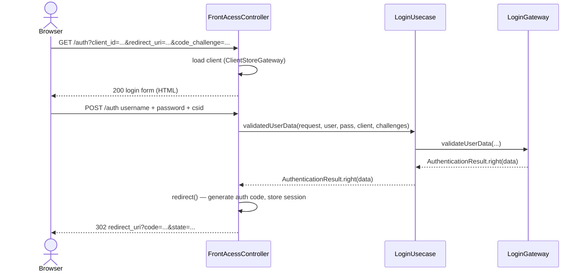
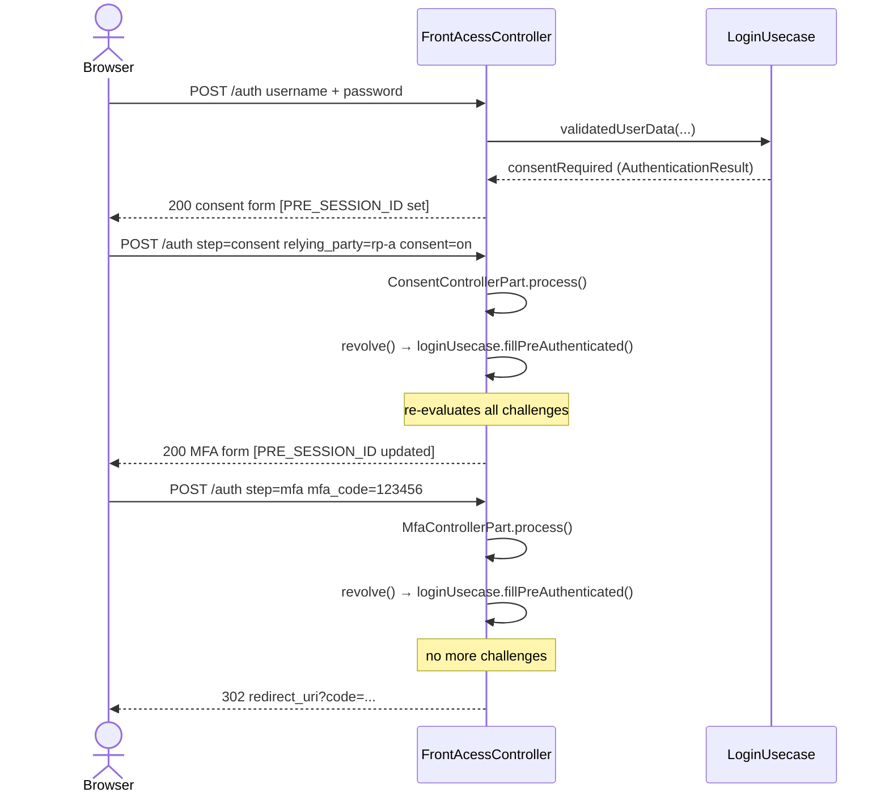
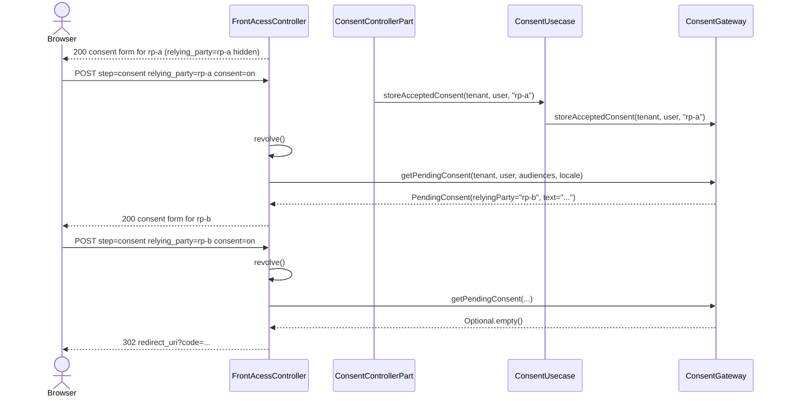
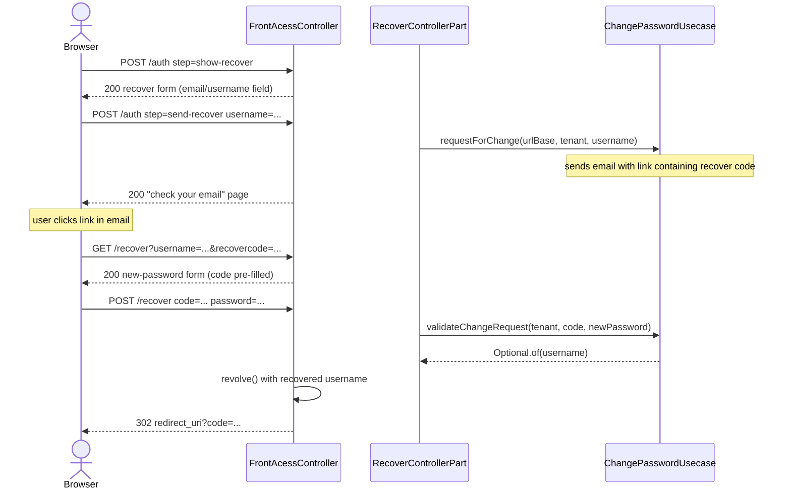
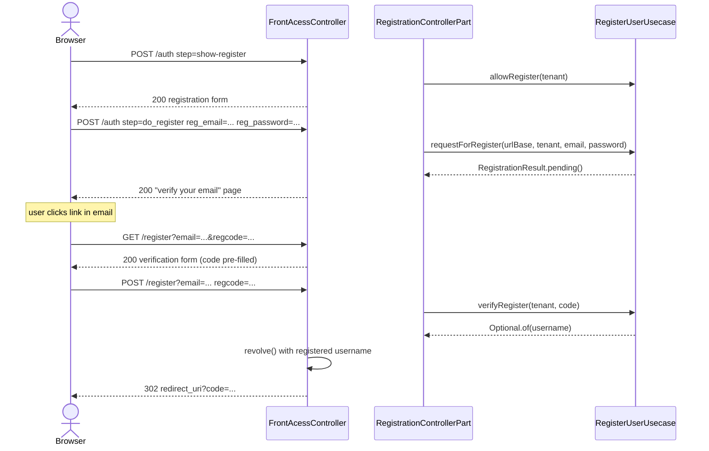
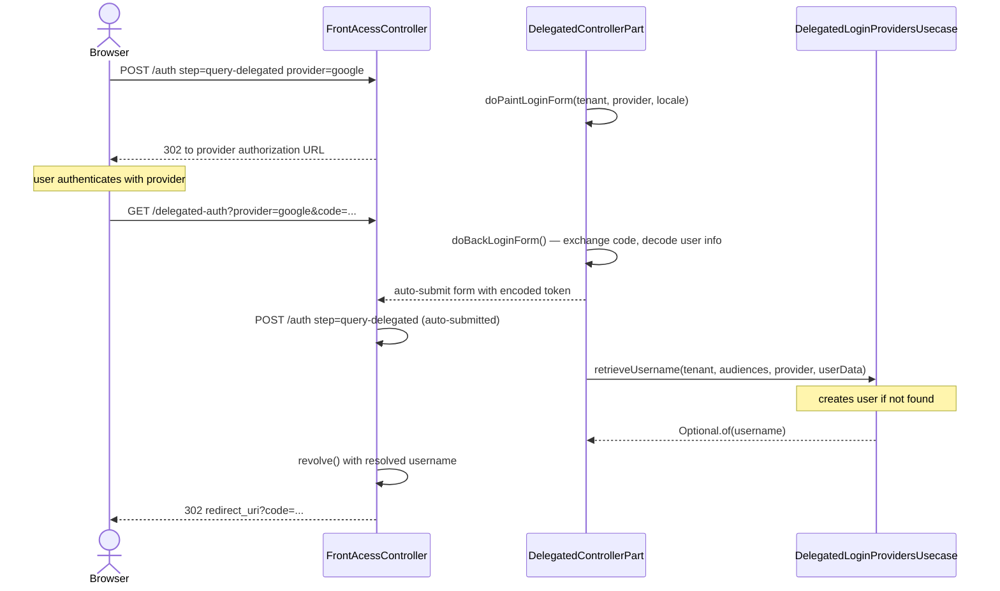
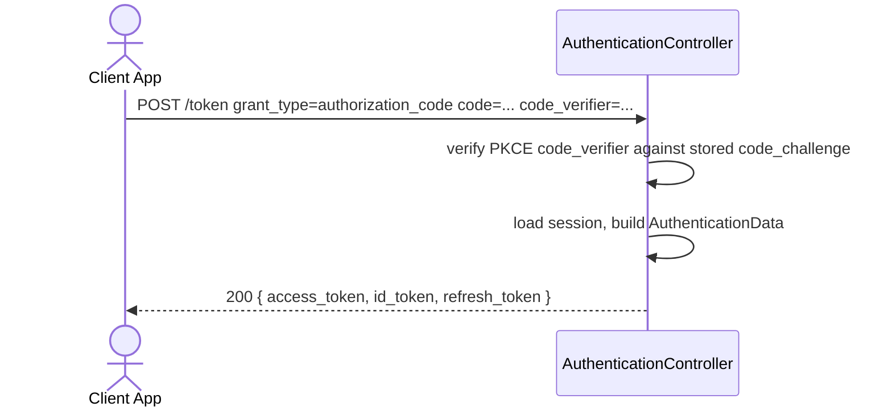
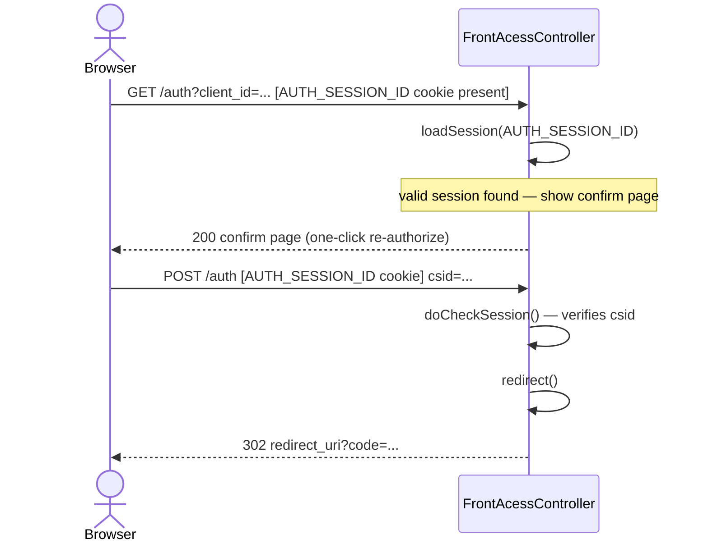

# OAuth / OIDC — Flow diagrams

## 1. Authorization Code flow (happy path)

The standard path: user has no pending challenges after login.

---

## 2. Multi-challenge flow

After credentials are accepted, additional challenges are evaluated sequentially by `revolve()`.

---

## 3. Consent flow — sequential per relying party

When a token request includes multiple `audience` values each RP may require its own consent.
Forms are shown one at a time. See [ADR-001](../adr/001-sequential-consent.md).

---

## 4. Password recovery flow

---

## 5. User self-registration flow

---

## 6. Delegated login (external provider)

---

## 7. Token exchange (Authorization Code → tokens)

---

## 8. Existing session — no re-login

